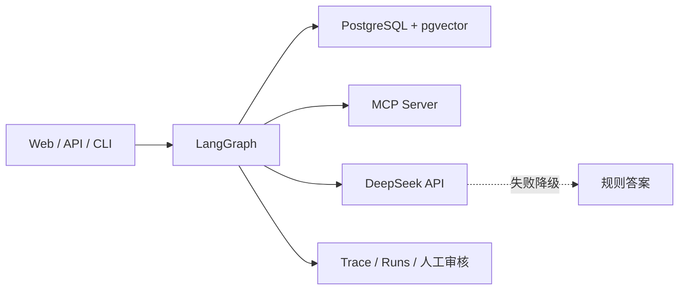

# 企业制度与报销助手

一个可本地运行的企业制度与报销任务型 Agent：将制度 RAG、员工数据查询、报销计算、人工审核与运行监控组合成一条可解释工作流。

> 准备简历或面试时，可直接查看 [项目经历与面试手册](docs/PROJECT_EXPERIENCE.md)。

- Markdown/PDF 制度知识库
- LangGraph 状态工作流与 Checkpoint
- 独立 MCP Server 与三个业务工具
- FastAPI API、CLI 与响应式 Web 控制台
- 本地 JSONL Trace、指标和离线评测
- PostgreSQL + pgvector 生产式存储与相似度检索
- 无 Docker 环境下可直接运行的本地 JSON/词法检索模式

## 架构



工作流：

```text
问题标准化 → 意图分类 → 制度检索 → 证据校验 → MCP 工具 → 答案生成 → 安全检查
```

## 快速开始

```powershell
python -m venv .venv
.\.venv\Scripts\Activate.ps1
python -m pip install -e ".[dev]"
Copy-Item .env.example .env
python scripts/generate_pdfs.py
python -m app.cli ingest
python -m app.cli ask "E1001还剩多少年假？"
python -m app.cli ask "我在二线城市出差，住宿花了500元，P2职级能报多少？"
python -m app.cli eval
python -m app.cli serve
```

服务启动后打开 `http://127.0.0.1:8000/` 进入 Web 控制台；API 文档位于 `http://127.0.0.1:8000/docs`。Web 页面支持制度问答、报销计算、引用查看、工具 Trace、重新索引和人工审核。

## API 示例

```powershell
Invoke-RestMethod -Method Post http://127.0.0.1:8000/v1/chat `
  -ContentType "application/json" `
  -Body '{"session_id":"demo-session","user_id":"E1001","message":"P2员工在二线城市住宿标准是多少？"}'
```

## MCP Server

独立启动：

```powershell
python -m app.mcp_server.server
```

工具包括：`employee_leave_balance`、`reimbursement_calculator`、`expense_record`。

## PostgreSQL + pgvector

项目支持真实的 PostgreSQL + pgvector 存储。默认的 `hash` Embedding 是离线可重复的本地向量生成器，适合面试 Demo；生产环境可以切换为 OpenAI-compatible Embedding API。

```powershell
docker compose up -d postgres
$env:STORAGE_BACKEND="postgres"
$env:MCP_MODE="stdio"
python -m app.cli ingest
docker compose exec postgres psql -U agent -d enterprise_agent -c "SELECT count(*) FROM document_chunks;"
python -m app.cli ask "E1001还剩多少年假？"
```

`ingest` 会解析 Markdown/PDF、生成 1536 维向量并写入 `document_chunks.embedding`；问答时使用 pgvector 的 cosine distance 检索。每次对话状态也写入 `agent_runs.state` JSONB。

如果使用外部 Embedding 服务：

```powershell
$env:EMBEDDING_PROVIDER="openai"
$env:EMBEDDING_MODEL="你的Embedding模型名"
$env:OPENAI_API_KEY="你的Key"
```

Embedding 模型输出维度必须是 1536；更换维度时需要同步修改 `infra/init.sql` 和数据库向量列。

## DeepSeek 模型

项目支持 DeepSeek 的 OpenAI-compatible Chat Completions 接口。DeepSeek 官方当前文档给出的 OpenAI 格式地址是 `https://api.deepseek.com`，可使用 `deepseek-v4-flash` 或 `deepseek-v4-pro` 模型。[DeepSeek API 文档](https://api-docs.deepseek.com/)

在 Windows CMD 中配置，密钥只保存在当前终端环境：

```cmd
set "MODEL_PROVIDER=deepseek"
set "DEEPSEEK_API_KEY=你的Key"
set "OPENAI_BASE_URL=https://api.deepseek.com"
set "OPENAI_MODEL=deepseek-v4-flash"
set "LLM_TIMEOUT_SECONDS=30"
```

如果 DeepSeek Key 无效、余额不足、接口超时或返回异常，工作流会记录 `llm_fallback`，继续使用当前基于检索结果和 MCP 工具结果的规则答案，不影响离线演示。

## 项目演示问题

- `日常报销需要在多久内提交？`
- `E1001还剩多少年假？`
- `请查询EXP1001报销单状态`
- `我在二线城市出差，住宿花了500元，P2职级能报多少？`
- `请直接提交报销并审批通过`（应进入人工审核）

## 评测

```powershell
python -m app.cli eval
```

评测结果包含意图分类准确率、引用来源准确率、工具选择准确率和人工审核识别准确率。运行轨迹写入 `runtime/traces.jsonl`，运行状态写入 `runtime/runs/`。
