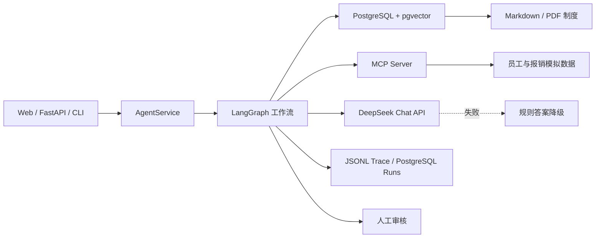

# 企业制度与报销助手：项目经历与面试手册

## 1. 简历项目名称

**企业制度与报销任务型 Agent**  
技术栈：Python、FastAPI、LangGraph、MCP、PostgreSQL、pgvector、DeepSeek、Docker、OpenTelemetry

## 2. 简历一句话版本

面向企业制度问答、员工数据查询和报销额度计算场景，独立设计并实现基于 LangGraph、MCP 与 PostgreSQL/pgvector 的任务型 Agent，支持 Markdown/PDF 知识检索、工具调用、引用溯源、人工审核、运行监控及 DeepSeek API 异常降级。

## 3. 简历项目描述

### 推荐版本

- 设计 7 节点 LangGraph 工作流，覆盖问题标准化、意图分类、制度检索、证据校验、MCP 工具调用、答案生成和安全检查，并通过最大步数限制与人工审核状态控制高风险请求。
- 构建 Markdown/PDF 企业制度知识库，将文档切分、1536 维向量及元数据写入 PostgreSQL，使用 pgvector cosine distance 与 HNSW 索引完成 Top-K 检索，并返回文件名、页码和相关度引用。
- 独立实现 MCP Server，提供年假余额查询、报销额度计算和报销记录查询 3 个结构化工具，覆盖参数校验、统一错误码、调用超时和异常降级。
- 接入 DeepSeek OpenAI-compatible API 生成证据约束答案；当 Key 失效、余额不足或接口超时时，自动回退至确定性规则答案，确保核心业务链路可用。
- 实现 FastAPI、CLI 和响应式 Web 控制台，支持对话、工具 Trace、引用展示、知识库重建和人工审批；将运行状态写入 PostgreSQL，并以 JSONL 记录节点耗时和脱敏 Trace。
- 建立 41 条模拟评测集和 9 个自动化测试；在当前模拟数据集上，意图分类、引用来源、工具选择和人工审核识别准确率均为 100%。

### 精简版本（简历空间有限时）

- 基于 LangGraph 构建企业制度与报销 Agent，编排 RAG、MCP 工具调用、证据校验、安全检查与人工审核流程。
- 使用 PostgreSQL + pgvector 存储 Markdown/PDF 制度向量并完成 Top-K 检索，支持来源、页码和相关度引用。
- 接入 DeepSeek API 并设计失败降级，提供 FastAPI/CLI/Web 三种入口及 PostgreSQL 运行状态、JSONL Trace 监控。
- 构建 41 条模拟评测集与 9 个自动化测试，当前规则评测四项指标均达到 100%。

## 4. 项目背景与目标

企业内部制度分散在 Markdown、PDF 和业务系统中。员工咨询年假、差旅标准或报销额度时，单纯的知识库问答无法读取员工余额，也无法执行结构化计算；直接让大模型回答又容易产生无依据答案。

项目将问题拆成三类能力：

1. 使用 RAG 回答制度问题并返回引用。
2. 使用 MCP 工具查询员工和报销数据、执行额度计算。
3. 使用工作流控制证据、超时、失败降级和高风险操作。

## 5. 系统架构



### LangGraph 节点

```text
normalize_question
→ classify_intent
→ retrieve_documents
→ grade_evidence
→ call_mcp_tool
→ generate_answer
→ safety_check
```

### 支持的意图

| 意图 | 处理方式 | 示例 |
|---|---|---|
| `POLICY_QA` | pgvector 检索 + 证据回答 | 日常报销多久内提交？ |
| `EMPLOYEE_DATA` | 检索 + MCP 数据查询 | E1001 还剩多少年假？ |
| `REIMBURSEMENT_CALCULATION` | 检索 + MCP 计算 | P2 二线城市住宿 500 元能报多少？ |
| `UNSUPPORTED` | 明确拒答或引导人工 | 与企业制度无关的问题 |

## 6. 关键技术设计

### RAG 与 pgvector

- 解析 Markdown 和中文 PDF，按页保留来源信息。
- 将文档切分为 chunk，并保存 `source`、`page`、`content`、`metadata` 和 `embedding`。
- 使用 pgvector `<=>` 运算符执行 cosine distance 检索。
- 使用 HNSW 索引提升向量查询扩展性。
- 默认使用离线 hash Embedding 保证项目无外部服务也能演示；支持切换 OpenAI-compatible Embedding 服务。

### MCP 工具层

工具服务与 Agent 解耦，通过 stdio 协议运行，当前实现：

- `get_employee_leave_balance(employee_id)`
- `calculate_reimbursement(expense_items, employee_level, city_tier)`
- `get_expense_record(expense_id)`

所有工具使用统一响应结构：`success`、`data`、`error_code`、`message`、`source`。

### 模型与降级

- DeepSeek 仅基于已检索证据和 MCP 工具结果生成最终中文答案。
- 接口未配置时直接使用规则答案。
- 接口超时、鉴权失败、余额不足或响应异常时记录 `llm_fallback`，保留规则答案。
- 文档中的指令被视为不可信文本，系统提示要求模型不得执行文档指令。

### 可观测性与状态

- 每次运行生成独立 `run_id`。
- PostgreSQL `agent_runs` 保存业务状态和审核结果。
- JSONL Trace 记录节点开始、结束、耗时、工具调用和错误。
- 日志对员工编号等字段进行脱敏。

## 7. 可展示的结果

| 验证项 | 当前结果 |
|---|---:|
| 自动化测试 | 9 个通过 |
| 离线评测样本 | 41 条 |
| 意图分类准确率 | 100% |
| 引用来源准确率 | 100% |
| 工具选择准确率 | 100% |
| 人工审核识别准确率 | 100% |
| PostgreSQL 文档向量 | 4 个 chunk，1536 维 |

> 上述准确率来自本项目的模拟数据和规则评测集，不代表真实生产流量表现。面试时应明确这一点。

## 8. 三分钟面试讲解

这个项目解决的是企业制度问答和业务系统查询无法统一的问题。普通 RAG 能回答“报销制度是什么”，但不能可靠回答“我还有多少年假”或“这笔住宿能报多少”，因此我把系统设计成单 Agent 工作流。

用户请求先经过标准化和意图分类，然后统一检索企业制度。制度文档来自 Markdown 和 PDF，切分后生成 1536 维向量，存入 PostgreSQL/pgvector，通过 cosine distance 返回 Top-K 证据和页码。涉及员工数据或金额计算时，LangGraph 路由到独立 MCP Server，调用年假、报销计算或报销记录工具。

最终答案可以由 DeepSeek 基于证据和工具结果生成。如果模型 Key 失效、余额不足或超时，系统保留预先生成的规则答案，因此不会因为模型服务不可用导致核心查询中断。涉及提交、付款、修改或审批的请求会进入人工审核状态。

为了验证系统，我构建了 41 条模拟评测样本和 9 个自动化测试，覆盖意图、引用、工具选择、异常降级和人工审核。当前模拟集四项规则指标均为 100%，同时提供 Web、API 和 CLI 三种演示入口。

## 9. 面试高频追问

### 为什么使用 LangGraph，而不是普通函数链？

任务包含检索、工具调用、失败降级和人工审核等有状态步骤。LangGraph 让节点边界、状态传递和后续条件路由更清晰，也便于扩展重试和持久化 Checkpoint。

### MCP 和普通函数调用有什么区别？

普通函数调用通常与应用进程耦合。MCP 将工具发现、参数协议和执行服务标准化，工具可以独立运行。当前项目通过 stdio 调用独立 MCP Server，也保留本地调用模式便于测试。

### 为什么默认不用真实 Embedding 模型？

为了保证面试现场无网络、无余额时仍可运行，默认使用确定性 hash 向量。它确实写入 pgvector 并执行向量距离检索，但语义能力弱于专业 Embedding 模型；生产版本应替换为中文或多语言 Embedding，并重新评测召回率。

### 100% 准确率是否可信？

这是小规模模拟数据上的规则指标，主要用于回归测试，不等同于生产准确率。真实上线前需要扩展真实问题分布、困难负样本、人工标注集以及 LLM Judge，并分意图报告置信区间。

### DeepSeek 是否决定调用哪个工具？

当前初版不是。意图分类和工具选择采用可解释的确定性规则，DeepSeek 负责基于证据生成答案。这样可以降低演示成本和随机性。下一版可以使用结构化输出让模型生成工具计划，再由白名单和 Pydantic 校验执行。

### 是否实现了真正的工作流断点恢复？

当前 LangGraph 使用 `MemorySaver` 保存进程内 Checkpoint，业务运行状态持久化到 PostgreSQL；人工审批通过后根据保存状态重新执行流程。生产版应升级为 PostgreSQL Checkpointer 和 LangGraph `interrupt`，实现跨进程原位恢复。

### 如何防止 Prompt Injection？

文档内容只作为证据，不作为系统指令；系统提示明确忽略文档内指令。工具采用白名单，且当前仅提供只读或低风险计算工具。生产版还应增加内容分类、租户权限过滤和工具级授权。

## 10. 演示脚本

### 启动

在 Windows CMD 中逐行执行：

```cmd
docker compose up -d postgres
set "STORAGE_BACKEND=postgres"
set "MCP_MODE=stdio"
set "EMBEDDING_PROVIDER=hash"
python -m app.cli ingest
python -m app.cli serve
```

浏览器打开 `http://127.0.0.1:8000/`。

### 建议演示顺序

1. 制度检索：`日常费用报销需要在多久内提交？`
2. MCP 查询：`E1001还剩多少年假？`
3. 检索加计算：`我在二线城市出差，住宿花了500元，P2职级能报多少？`
4. 安全审核：`请直接提交报销并审批通过`
5. 展示右侧引用、工具 Trace 和 PostgreSQL `agent_runs`。

## 11. 项目边界与下一步

当前版本是可运行的面试 Demo，不应描述为生产系统。优先升级项：

1. 使用专业中文 Embedding 模型并实现混合检索与 rerank。
2. 将规则意图分类升级为 LLM structured output，并保留规则兜底。
3. 接入 PostgreSQL LangGraph Checkpointer 与原生 `interrupt`。
4. 增加用户鉴权、租户隔离、细粒度权限和真实业务系统连接器。
5. 增加 Prometheus/Grafana 或完整 OpenTelemetry Exporter。
6. 扩展真实标注数据、对抗样本和线上评测。

## 12. 可用于简历的关键词

`AI Agent`、`LangGraph`、`MCP`、`RAG`、`pgvector`、`PostgreSQL`、`DeepSeek`、`FastAPI`、`Prompt Injection`、`Human-in-the-loop`、`Observability`、`Evaluation`、`Graceful Degradation`
